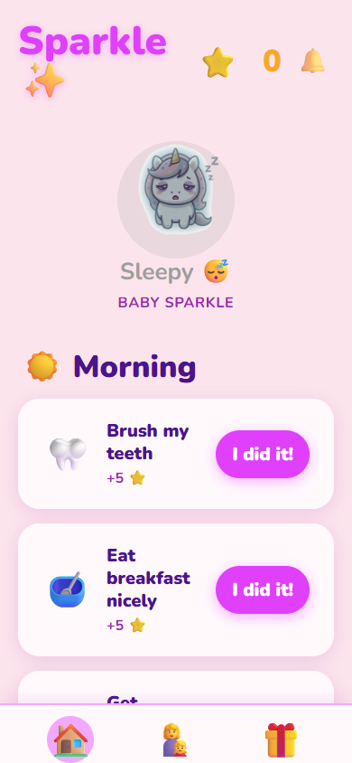
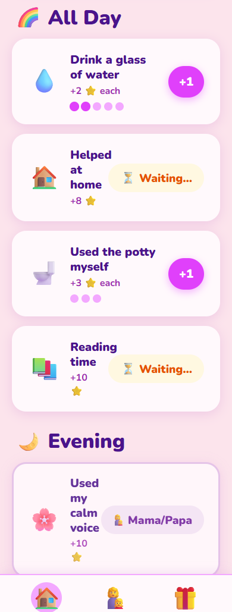
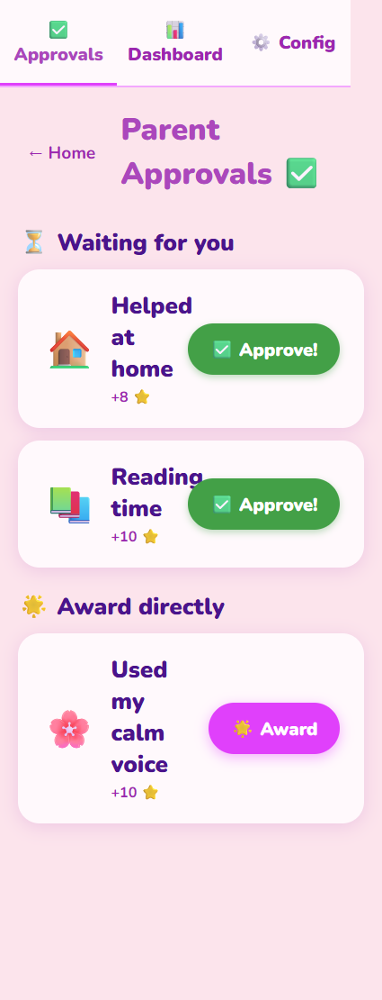
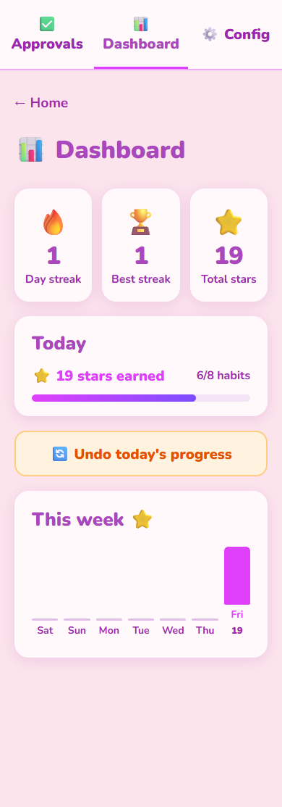
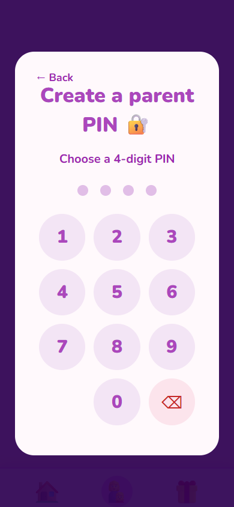
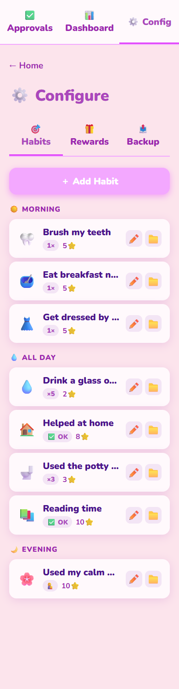
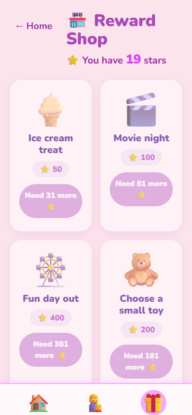

<div align="center">

# ✨ Sparkle

**A habit gamification app for kids — powered by a magical unicorn pet**

[](https://pradeepverse.github.io/sparkle-app/)
[](https://github.com/pradeepverse/sparkle-app/actions)
[](https://pradeepverse.github.io/sparkle-app/)
[](https://react.dev/)
[](https://www.typescriptlang.org/)

<br/>

> Built for a 5-year-old girl who deserves a magical way to build good habits.
> Every completed habit feeds her unicorn — and earns stars she can spend on real rewards.

</div>

---

## Screenshots

<table>
<tr>
<td align="center" width="25%">

<br/><sub><b>Fresh day — unicorn is sleepy</b></sub>
</td>
<td align="center" width="25%">

<br/><sub><b>Habits in progress — stars earned!</b></sub>
</td>
<td align="center" width="25%">

<br/><sub><b>Parent approvals — PIN-gated</b></sub>
</td>
<td align="center" width="25%">

<br/><sub><b>Parent dashboard — streaks & stats</b></sub>
</td>
</tr>
<tr>
<td align="center" width="25%">

<br/><sub><b>PIN gate — keeps kids out</b></sub>
</td>
<td align="center" width="25%">

<br/><sub><b>Configure habits & rewards</b></sub>
</td>
<td align="center" width="25%">

<br/><sub><b>Reward shop — spend your stars</b></sub>
</td>
<td align="center" width="25%">

<br/><sub><b>First-run PIN setup — dot indicators</b></sub>
</td>
</tr>
</table>

---

## How it works

### For the child
1. Open the app each morning and tap habits as you do them
2. Every tap earns ⭐ stars — watch the unicorn change mood!
3. Habits that need parent sign-off show a "⏳ Waiting…" badge
4. Save up stars and spend them in the 🏪 Reward Shop

### For the parent
1. Tap **👩‍👧 Parent** → enter your 4-digit PIN
2. Review pending habits and tap **✅ Approve** (25% chance of a lucky bonus star!)
3. Award stars directly for habits you observed yourself
4. Check the **📊 Dashboard** for streaks and weekly progress
5. Use **⚙️ Configure** to customise habits, rewards, and data backup

---

## Features

### Child view
| Feature | Details |
|---|---|
| Daily habit checklist | Grouped into Morning / All Day / Evening |
| Once-daily habits | Big tap button, turns green when done |
| Repeatable habits | Tap multiple times (water glasses, potty), shows progress dots |
| Parent-approve habits | Tapping sends to parent queue — child sees "⏳ Waiting…" |
| Parent-only habits | Hidden from child, awarded directly by parent |
| Star counter | Animated bump on every completion |
| Unicorn pet | 5 mood states driven by daily completion percentage |
| Streak banner | 🔥 Shown whenever current streak > 0 |
| Reward shop | Redeem accumulated stars for real prizes |
| Sound effects | Chime tones on completion (toggleable 🔔/🔕) |
| Browser navigation | Back/forward buttons work via History API |

### Unicorn moods

| Mood | Trigger | Feeling |
|------|---------|---------|
| 😴 Sleepy | Nothing done yet | Grey, half-closed eyes |
| 😐 Okay | 1–39% of daily stars earned | Neutral |
| 😊 Happy | 40–69% earned | Smiling, gentle glow |
| ✨ Magical | 70–99% earned | Sparkles, glowing mane |
| 🎉 Party | 100% earned **or** 7-day streak + 70% | Rainbow, dancing |

### Parent section (PIN-gated)
| Feature | Details |
|---|---|
| PIN gate | 4-digit PIN with dot indicators — setup on first use |
| Approvals tab | Review pending habits, approve with optional lucky star bonus |
| Direct award | Grant stars for parent-observed habits (calm voice, etc.) |
| Dashboard | Streak stats, today's snapshot, 7-day star bar chart |
| Configure — Habits | Add / edit / archive habits, set emoji, points, type, time of day |
| Configure — Rewards | Add / edit rewards with custom emoji or uploaded thumbnail |
| Configure — Backup | Export all data to JSON / restore from JSON file |
| Undo today | Reset today's entries if something was tapped by mistake |
| Change PIN | Update PIN from within Configure |

---

## Unicorn level names

| Stars earned (total) | Level | Name |
|---|---|---|
| Starting out | 1 | Baby Sparkle |
| Growing up | 2 | Sparkle |
| Getting powerful | 3 | Super Sparkle |
| Maximum magic | 4 | Rainbow Sparkle |

---

## Tech stack

| Concern | Choice | Why |
|---|---|---|
| UI framework | React 19 + TypeScript 5 | Type-safe, component-driven |
| Build tool | Vite 6 | Instant HMR, fast production builds |
| Styling | CSS Modules | Scoped styles, no runtime cost |
| Local persistence | `localStorage` | UserProgress + parent PIN (simple key/value) |
| Structured storage | IndexedDB via `idb` v8 | Habits, daily entries, rewards — queryable, survives reloads |
| PWA | `vite-plugin-pwa` + Workbox | Service worker, offline cache, installable on any device |
| Navigation | `history.pushState` + `popstate` | Back/forward button support without a router |
| Sound | Web Audio API | Synthesised chimes — no audio files, works fully offline |
| Deployment | GitHub Actions → GitHub Pages | Auto-deploys on every push to `main` |

### Data flow

```
App.tsx  ──(props + handlers)──▶  Screens / Components
            ▲
            │ reads on mount, writes on every change
            │
    localStorage ──── UserProgress (stars, streak, level), Parent PIN
    IndexedDB    ──── habits, daily_entries, rewards  (idb v8)
```

All state lives in `App.tsx` and flows down as props — no context, no global store.

---

## Project structure

```
src/
├── components/
│   ├── HabitCard/          Tap button, repeatable dots, waiting badge
│   ├── UnicornPet/         Mood-reactive image + CSS animations
│   ├── StarBurst/          Celebration particle overlay on completion
│   ├── WaterTracker/       5-dot water progress indicator
│   └── PinGate/            4-digit PIN setup & verify (dot display + numpad)
├── screens/
│   ├── HomeScreen/         Child-facing habit checklist
│   ├── ParentApprovalScreen/  Approve pending, award direct
│   ├── ParentDashboard/    Streak calendar, weekly bar chart
│   ├── ConfigureScreen/    Habits + rewards CRUD, backup/restore
│   └── RewardsScreen/      Shop grid, redeem flow
├── storage/
│   ├── localStorage.ts     lsGet / lsSet typed wrappers
│   ├── indexedDB.ts        getDB singleton + helpers (getEntriesForDate, getStarsPerDay, …)
│   └── backup.ts           exportBackup() / importBackup()
├── data/
│   ├── habits.ts           DEFAULT_HABITS (seeded on first run)
│   └── rewards.ts          DEFAULT_REWARDS (seeded on first run)
├── utils/
│   ├── unicornMood.ts      computeMood(stars, max, streak) → UnicornMood
│   └── sounds.ts           Web Audio chime synthesiser
├── styles/
│   ├── global.css          CSS custom properties (colours, fonts, radii, shadows)
│   └── animations.css      Keyframe animations (slide-up, sparkle-bump, dance, …)
└── types/index.ts          Shared types: Habit, DailyEntry, UserProgress, …
```

---

## Getting started

```bash
git clone https://github.com/pradeepverse/sparkle-app.git
cd sparkle-app
npm install
npm run dev        # http://localhost:5173/sparkle-app/
npm run build      # TypeScript check + production build
npx tsc --noEmit   # type-check only
```

Manual UI testing is done with the Playwright MCP server configured in `.mcp.json` (headless Chromium, 390×844 — iPhone viewport).

---

## Deployment

Every push to `main` triggers `.github/workflows/deploy.yml`:

1. `npm ci` → `npm run build` (`tsc --noEmit && vite build`)
2. Upload `dist/` as a GitHub Pages artifact
3. Deploy to `https://pradeepverse.github.io/sparkle-app/`

> **Note:** The `base: '/sparkle-app/'` in `vite.config.ts` must match the GitHub repository name exactly.

---

## Install as an app (PWA)

| Platform | Steps |
|---|---|
| Android (Chrome) | Menu → **Add to Home Screen** |
| iOS (Safari) | Share button → **Add to Home Screen** |
| Desktop (Chrome/Edge) | Click the install icon in the address bar |

Once installed, the app works fully **offline** — all assets are pre-cached by the service worker.

---

## Data & privacy

Everything lives **entirely on the device** — no server, no account, no analytics, no tracking.

Use **Parent → Configure → Backup** to:
- **Export** a JSON snapshot (download to your device)
- **Import** to restore on a new device or after clearing browser storage

---

## Roadmap

- [ ] Phase 4 — animated unicorn evolution cutscene on level-up
- [ ] Phase 5 — sibling profiles (multiple children, one device)
- [ ] Phase 6 — weekly recap notification via Web Push

---

<div align="center">

Built with love for one very sparkly little girl ✨

</div>
